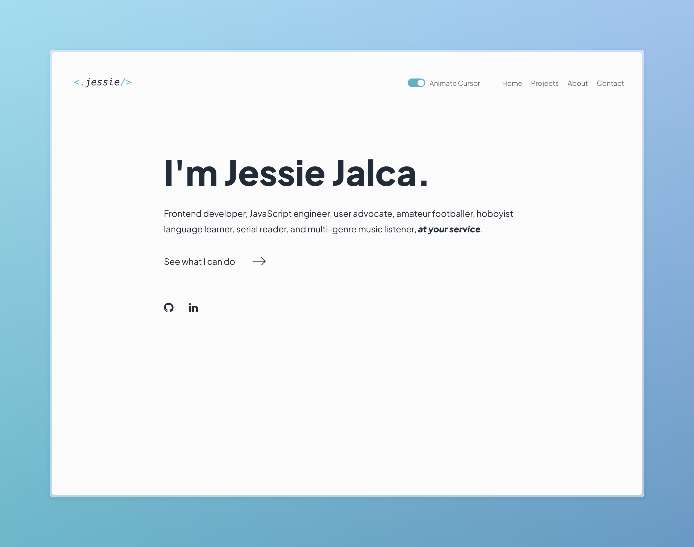

# Personal Portfolio



[Live Site URL](https://jessiejalca.dev)

## Table of contents

- [Personal Portfolio](#personal-portfolio)
  - [Table of contents](#table-of-contents)
  - [Built with](#built-with)
  - [Favorite Features](#favorite-features)
    - [Dark Mode](#dark-mode)
  - [Continued development](#continued-development)
  - [Author](#author)

## Built with

- Semantic HTML5 markup
- CSS
- [React](https://reactjs.org/)
- [React Animated Cursor](https://www.npmjs.com/package/react-animated-cursor)
- [Framer Motion](https://www.framer.com/motion/)

## Favorite Features

### Dark Mode

Dark Mode was one of my favorite features to add. It's kind of a must-have to me for most apps at this point, and I wanted to make sure that my portfolio had it. This, I knew, would simply be a trick of some good 'ole CSS.

I figured root CSS variables were a good place to start. Then, using CSS's cascading nature, I manipulated said variables within a dark-mode class that I could toggle on and off with a button.

```css
/* Variables */
:root {
  --primary-text-color: #202c39;
  --primary-bg-color: #fbfbfb;
  --secondary-bg-color: #ebebeb;
  --accent-blue: #46b1c9;
  --accent-gray: #8d9499;
  --toggle-color: #fff;

  color-scheme: light dark;
}
.dark-mode {
  --primary-bg-color: #202c39;
  --primary-text-color: #fbfbfb;
  --secondary-bg-color: #2c3e50;
  --accent-gray: #b8bbbd;
  --toggle-color: var(--primary-bg-color);
}
```

```jsx
const NavBar = (props) => {
  return (
    // --- rest of code

    <button className="toggle-box prevent-select" onClick={props.setDarkMode}>
      
      <label htmlFor="dark-mode-toggle" className="toggleLabel">
        Lights {props.darkMode ? "On" : "Off"}
      </label>
    </button>
  )
}
```

I also wanted to make the feature proactive, so I used the Window interface's matchMedia() method to check for the prefers-color-scheme CSS media feature for the user's preference setting in their OS. Otherwise, it will simply remember and use the user's last setting.

```js
const [darkMode, setDarkMode] = useState(
  window.matchMedia && // Check if the browser supports matchMedia
    window.matchMedia("(prefers-color-scheme: dark)").matches // Check if the OS has dark mode enabled
    ? true
    : localStorage.getItem("darkMode") === "true" // Get the initial state from localStorage
)
```

Beyond that, it was easy manipulation to change certain images or text based on the dark mode. Overall, dark mode was a fairly simple feature to integrate, but it's one of my favorites because it was so satisfying once it was up and running. And it made late night developing a little easier on the eyes.

<!-- ### Accessibility

Accessibility is essential to web development, so I wanted to make sure that my site met accessibility standards. In building my portfolio, I've tried to be mindful of using semantic HTML. But one thing I noticed while testing my site was that the controls for toggling dark mode and cursor animations was that they weren't reachable by keyboard. I realized they had to be turned into buttons, and although that was super simple to implement, it sent me down more of a rabbit hole about how I could step up my accessibility game.
And one major player I came across was using ARIA states and properties. So far, I've only implemented ARIA labels, to give semantic meaning to the subtitles of each page. -->

## Continued development

Currently, I'm still working on Project Cards and the list or grid that they will appear within. I also need to make the site more responsive. Right now, there's no layout adjustment for smaller screens, which is super important today, so that's high on my list for implementation.

I'm also looking for other improvements that can be made, especially concerning accessibility, usability, and, finally, to have a little bit of fun with it. For example, I may change the structure to be single-page, and allow the user to simply scroll rather than click to navigate to each page. Or I might share what I'm currently listening to using Spotify's API. The world's my oyster.

<!-- ## Useful resources

- [Example resource 1](https://www.example.com) - This helped me for XYZ reason. I really liked this pattern and will use it going forward.
- [Example resource 2](https://www.example.com) - This is an amazing article which helped me finally understand XYZ. I'd recommend it to anyone still learning this concept.

**Note: Delete this note and replace the list above with resources that helped you during the challenge. These could come in handy for anyone viewing your solution or for yourself when you look back on this project in the future.** -->

## Author

- Website - [Jessie Jalca](https://jessiejalca.dev)
- LinkedIn - [@jessiejalca](https://www.linkedin.com/in/jessiejalca/)
