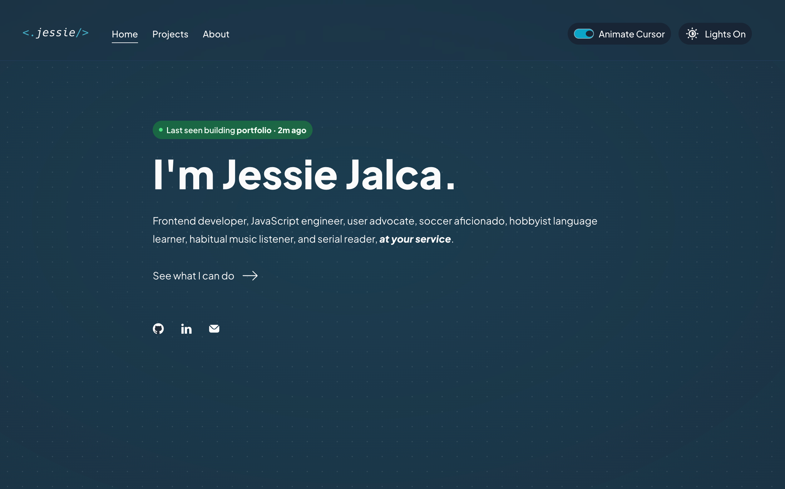

# jessiejalca.dev



My personal developer portfolio — built to show who I am, what I've built, and what I'm working towards.

🔗 [jessiejalca.dev](https://jessiejalca.dev)

## Built with

- [React](https://reactjs.org/)
- [Vite](https://vitejs.dev/)
- [Framer Motion](https://www.framer.com/motion/)
- [React Animated Cursor](https://www.npmjs.com/package/react-animated-cursor)

## Features

### Light/dark mode

Detects the user's OS preference via `prefers-color-scheme` on first load, then persists their choice in `localStorage`. Toggled via a button in the nav.

### Animated cursor

An optional cursor animation effect, toggled on/off by the user. Implemented with React Animated Cursor.

### Interactive background

A dot grid + gradient background that responds to mouse position, creating a subtle parallax-style effect. Built with CSS and vanilla JS event listeners.

### Live GitHub activity badge

Fetches my most recent public commit via the GitHub API and displays it as a live "Last seen building..." status badge with a pulsing indicator and relative timestamp. Updates on each page load, but uses cached data to protect against GitHub's 60 req/hr limit.

### Dynamic skills strip

Automatically aggregates tech stack tags from all project data, deduplicates them, and sorts by frequency of use — no manual curation needed. Updates automatically as new projects are added.

### Rotating 404 page

A custom 404 page with randomly selected heading and body copy combinations on each load, keeping the experience consistent with the site's voice.

### Responsive design

Fully responsive across desktop and mobile. Mobile layout includes a bottom navigation bar with icons for intuitive thumb navigation.

## Project structure

```
src/
├── components/       # Reusable UI components
├── data/             # Project data (source of truth for tags, etc.)
├── hooks/            # Custom React hooks
├── routes/           # Page-level route components
├── App.css           # Global styles and CSS variables
└── index.css         # Reset styles
```

## Running locally

```bash
# Install dependencies
yarn install

# Start dev server
yarn dev

# Build for production
yarn build
```

## Author

- Portfolio — [jessiejalca.dev](https://jessiejalca.dev)
- GitHub — [@jessiejalca](https://github.com/jessiejalca)
- LinkedIn — [@jessiejalca](https://www.linkedin.com/in/jessiejalca/)